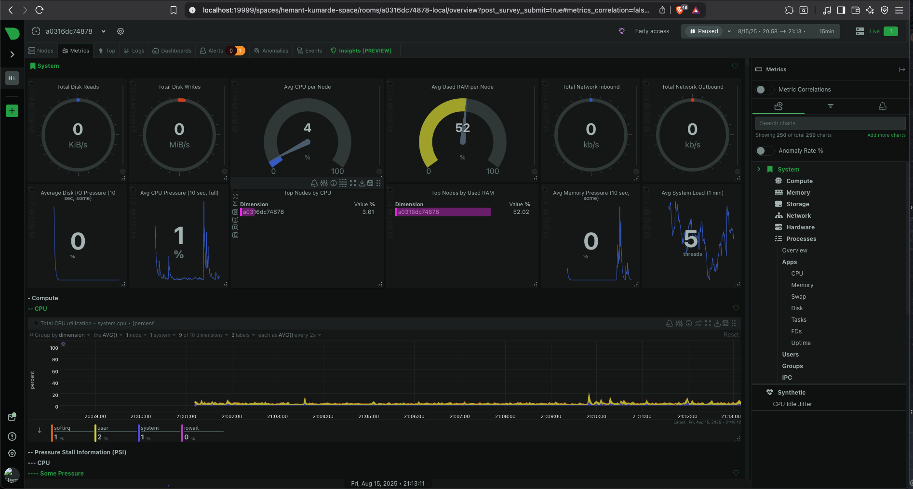
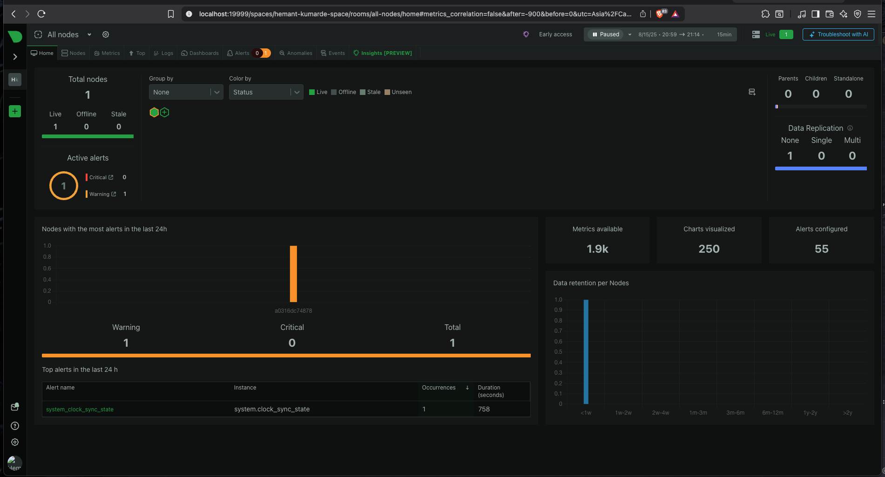

# Task-7-Netdata

## Quick Start

Run Netdata with Docker:
```bash
docker run -d --name=netdata -p 19999:19999 netdata/netdata
```

Access at: http://localhost:19999

## Screenshots



## Features
- CPU monitoring
- Memory monitoring  
- Disk monitoring
- Docker container monitoring
- Alerts and chart panels
- Logs in `/var/log/netdata`